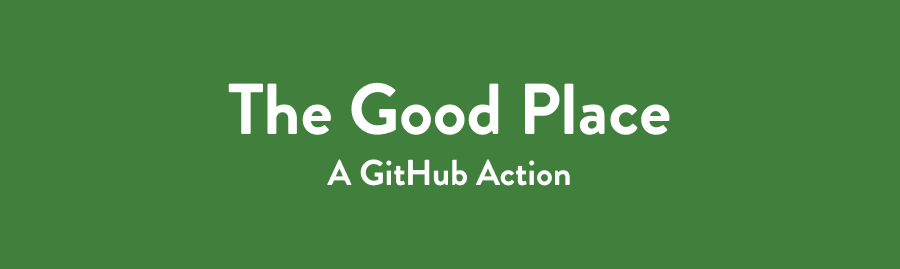
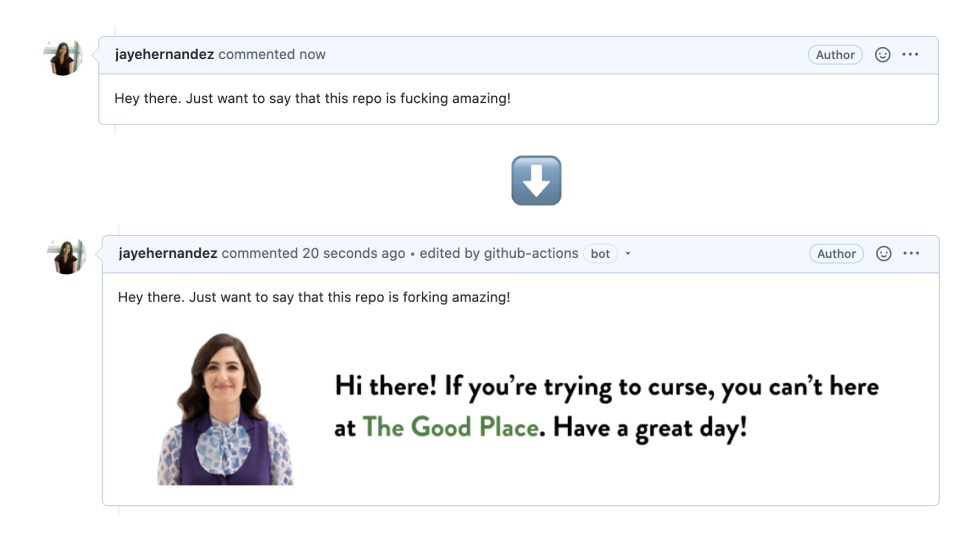
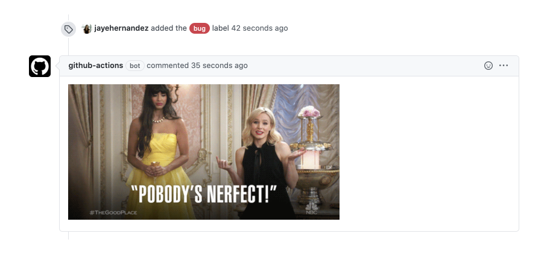

<p>
  <a href="https://github.com/jayehernandez/the-good-place#readme" target="_blank">
    
  </a>
  <a href="https://github.com/jayehernandez/the-good-place/blob/master/LICENSE" target="_blank">
    
  </a>
  <a href="https://twitter.com/jayehernandez_" target="_blank">
    
  </a>
</p>

> A GitHub Action that makes your repo a neighborhood in The Good Place

## 🍤 Features
- Replaces curse words with approved words in The Good Place



- Comments a forking accurate GIF when you first label an issue



## 🧐 How to Use
Create a new file titled `action.yml` inside the `.github/workflows` directory of your repository and copy the code below.

```yaml
on:
  issues:
    types: [opened, edited, labeled]
  issue_comment:
    types: [created, edited]
  pull_request:
    types: [opened, edited]
  pull_request_review_comment:
    types: [created, edited]
jobs:
  build:
    runs-on: ubuntu-latest
    name: The Good Place
    steps:
      - name: The Good Place Action
        uses: jayehernandez/the-good-place@v1
        with:
          repo-token: ${{ secrets.GITHUB_TOKEN }}
```

## 🙏🏻 Acknowledgements

* [Octokit Rest API](https://developer.github.com/v3/libraries/)
* GIFs from [Giphy](giphy.com)

Give a ⭐️ if you think this project is cool!

## 📝 License

Copyright © 2020 [Jaye Hernandez](https://jayehernandez.com).<br />
This project is [MIT](https://github.com/jayehernandez/the-good-place/blob/master/LICENSE) licensed.
